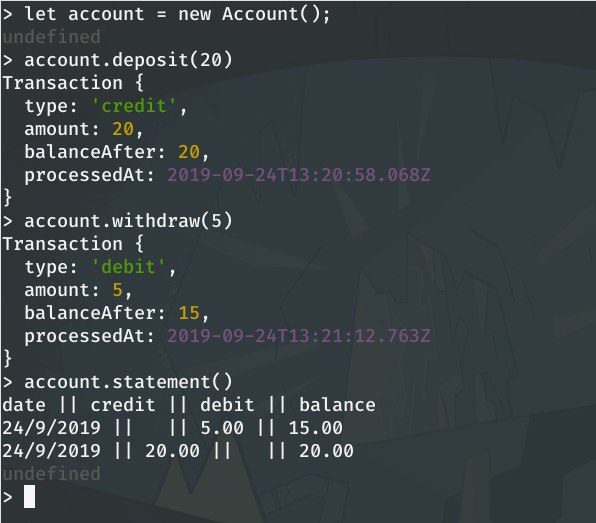

# Bank account Model (_Bank_ tech test)

## Installation

- Clone this repo:
`git clone git@github.com:Clepsyd/Bank.git`

- Make sure you're in the top level directory:
`cd Bank`

- If Node.js isn't installed on your system, follow the instructions here: https://nodejs.org/

- If you wish to run the test suite:

    - Install the dependencies: `npm install`

    - Run the tests: `npm test`

    - Run the tests with code coverage report: `npm run coverage -s`

    - Run the linter with ESLint: `npm run lint -s` (no output = linter passed)

## Usage

### Account public instance methods:

- #deposit(_amount_) _-> undefined_

    adds an integer _amount_ to the account's balance and returns a Transaction object.

- #withdraw(_amount_) _-> Transaction_

    substracts an integer _amount_ from the account's balance and returns a Transaction object.

- #statement _-> undefined_

    outputs to stdout a summary of all transactions that occurred on the account.

_For a detailed breakdown of the model, please refer to the [domain model here](DomainModel.md)_

### Usage example:

_In your terminal:_

```bash
$ node -r .
```
_This will open the node REPL pre-loaded with an Account constructor_
********
**Browser alternative to node:** _open index.html in your browser and open the console_
********
```javascript
let account = new Account();

account.deposit(20)
account.withdraw(5)

account.statement() 
/*
outputs the following:

date || credit || debit || balance
10/01/2012|| || 5.00 || 15.00
10/01/2012 || 20.00 || || 20.00
*/
```

Screenshot:


